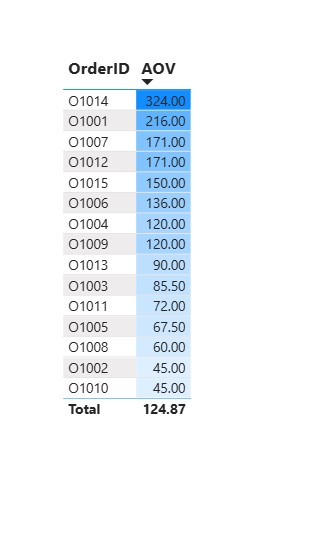

# sales-analysis-powerbi
Mini capstone project analyzing sales performance using Power BI.
# Sales Analysis with Power BI

## 📌 Project Overview
This mini capstone project analyzes sales performance data to provide insights into revenue, product performance, and customer behavior.  
The dashboard was built in **Power BI** with interactive visuals to support business decision-making.

## 🎯 Objectives
- Analyze sales trends over time (monthly/yearly revenue).
- Identify top-performing products and categories.
- Evaluate regional sales distribution.
- Provide actionable insights for business growth.

## 🛠️ Tools & Technologies
- **Power BI** – Data modeling & visualization
- **Excel/CSV** – Data source
- **DAX** – Measures and calculations
- **Data Visualization** – Charts, KPIs, interactive dashboards

## 📊 Dashboard Preview
  

## 📂 Project Structure
