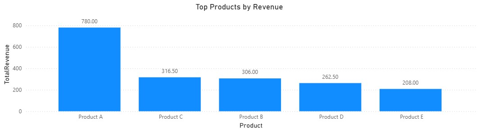
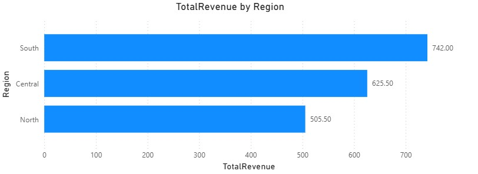
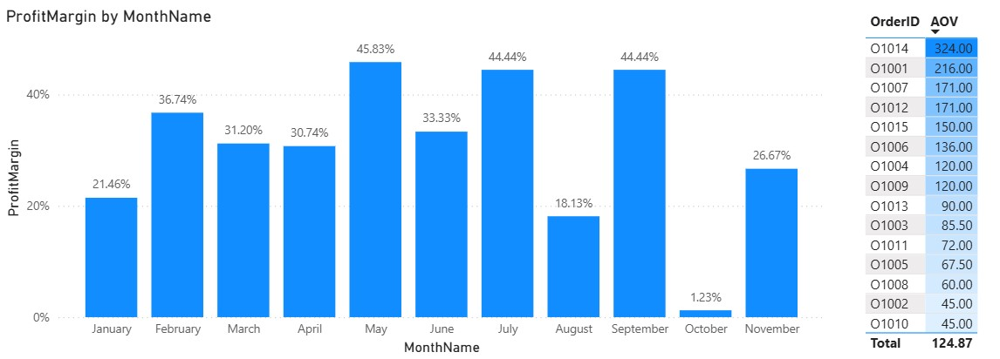

# sales-analysis-powerbi
Mini capstone project analyzing sales performance using Power BI.
# Sales Analysis with Power BI

## 📌 Project Overview
This mini capstone project analyzes sales performance data to provide insights into revenue, product performance, and customer behavior.  
The dashboard was built in **Power BI** with interactive visuals to support business decision-making.

## 🎯 Objectives
- Analyze sales trends over time (monthly/yearly revenue).
- Identify top-performing products and categories.
- Evaluate regional sales distribution.
- Provide actionable insights for business growth.

## 🛠️ Tools & Technologies
- **Power BI** – Data modeling & visualization
- **Excel/CSV** – Data source
- **DAX** – Measures and calculations
- **Data Visualization** – Charts, KPIs, interactive dashboards

## 📊 Dashboard Preview

### 1.Revenue & Profit Trend by Month

- Description: Line chart showing monthly revenue and profit trends.
- Insight: Revenue peaked in January and October, but profit margins were inconsistent, indicating potential cost management issues.

### 2. Top Products by Revenue

- Description: Column chart ranking products based on revenue contribution.
- Insight: Product A generates the highest revenue, significantly outperforming other products. This indicates Product A is the key revenue driver, while Products C, D, and E contribute much less.

### 3. Sales Distribution by Region

- Description: Bar Chart showing total revenue by region (South, Central, North).
- Insight: The South region contributes the highest share of revenue, while the Central and North regions generate significantly lower sales. This suggests focusing on maintaining South’s performance and exploring strategies to grow sales in weaker regions.

### 4. Customer Performance (AOV / Profit Margin)

- Description: KPI Cards or a simple Table showing:
   + Average Order Value (AOV) = Total Revenue / Number of Orders
   + Profit Margin = (Profit ÷ Revenue) × 100%
- Insight: The Average Order Value is relatively low, indicating customers spend modestly per transaction. At the same time, the Profit Margin suggests that while revenue is generated, profitability could be improved. This highlights opportunities to boost customer value through upselling, cross-selling, or product bundling.

## 📂 Project Structure
